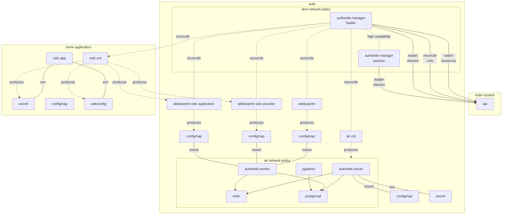

# Authentik Manager

Authentik-Manager (AKM) is a hybrid operator that deploys, configures, and manages the life-cycle of authentik, declaratively. This operator is primarily geared towards GitOps and enabling authentik to be consistently, reproducibly, and collaboratively managed.

This work is still under heavy development, but please submit an issue if you do try it out, and let us know if there are any problems.

## Documentation Versions

| Version | Docs                                             |
|---------|--------------------------------------------------|
| master  | https://georgeraven.gitlab.io/authentik-manager/ |

## At a Glimpse

