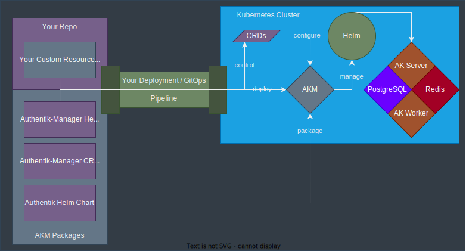

.. include:: /substitutions

.. _section_akm:

Authentik-Manager
=================

Authentik-Manager (AKM) is a hybrid |operator| with both Go and |helm| controllers.

Broadly AKM is deployed using either |gitops| or via |helm| charts directly. AKM is subsequently controlled and configured by |crd|\ s. These |crd|\ s can also be deployed via |gitops| enabling consistent, and repeatable deployments, from a central source of truth. Once AKM detects a |crd| that belongs to it, it will parse the |crd| and (re)configure |authentik| as necessary:

|flow|

AKM can be run in a highly available mode by simply scaling the number of pods in the AKM helm chart via your |gitops| pipeline or directly via |helm|. This uses an active-passive strategy where one leader is elected from the available pool of pods. This leader is then specifically responsible for reconciling the |crd|\ s of concern.

.. _section_crds:

Custom Resource Definitions
===========================

To control and configure AKM we use |crd|\ s. Following are all the currently available |crd|\ s and specifications for your use. Specific examples / sample files can be found in the ``operator/config/samples`` directory of the AKM source.

.. toctree::
  :glob:
  :maxdepth: 1
  :caption: AKM CRD Definitions and Descriptions

  /crds/*

Troubleshooting
---------------

Be careful of these things:

- Everything! We are in the super-early stages of development, tippy toes engage!
